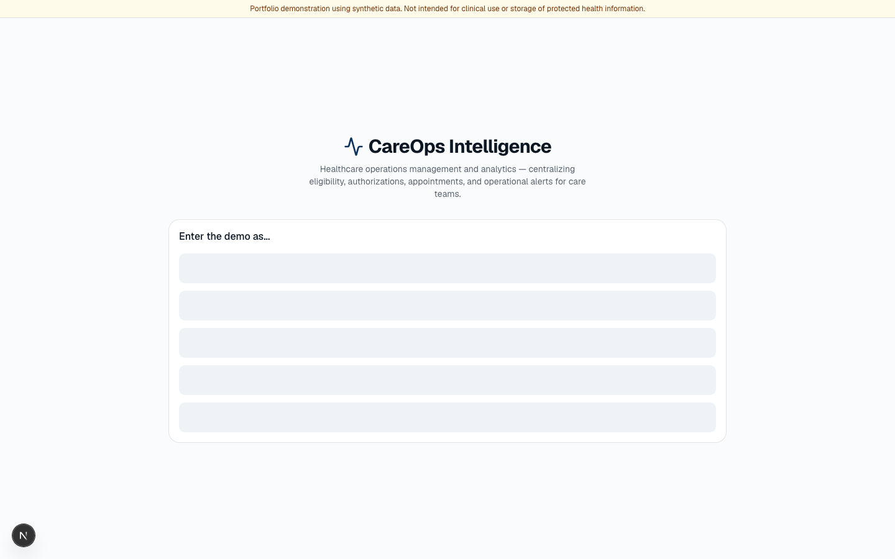
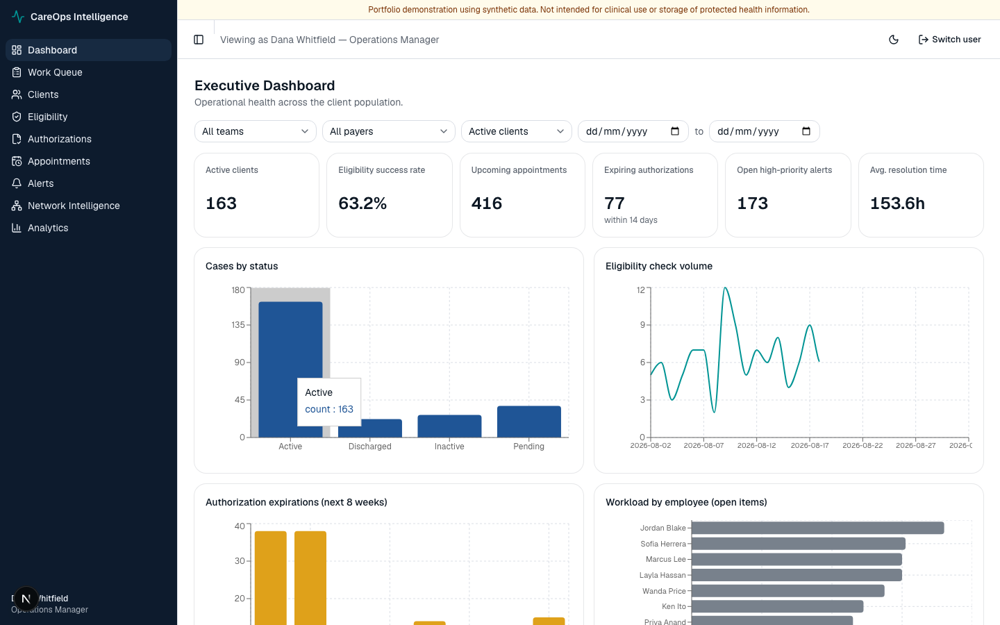
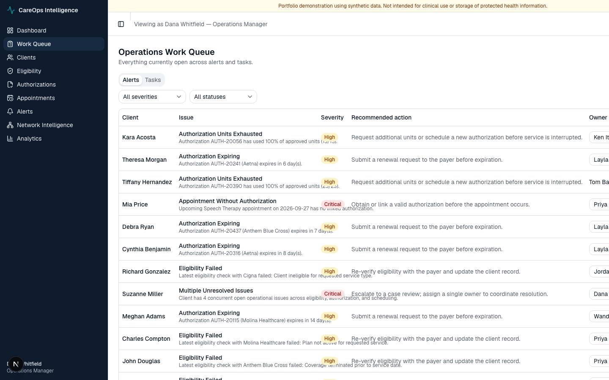
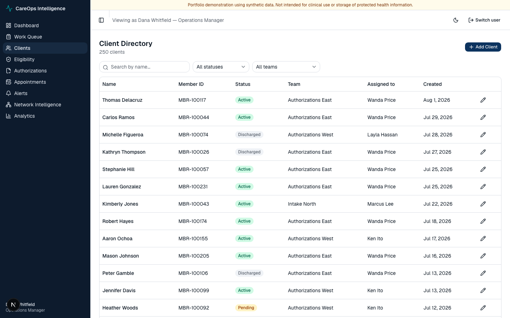
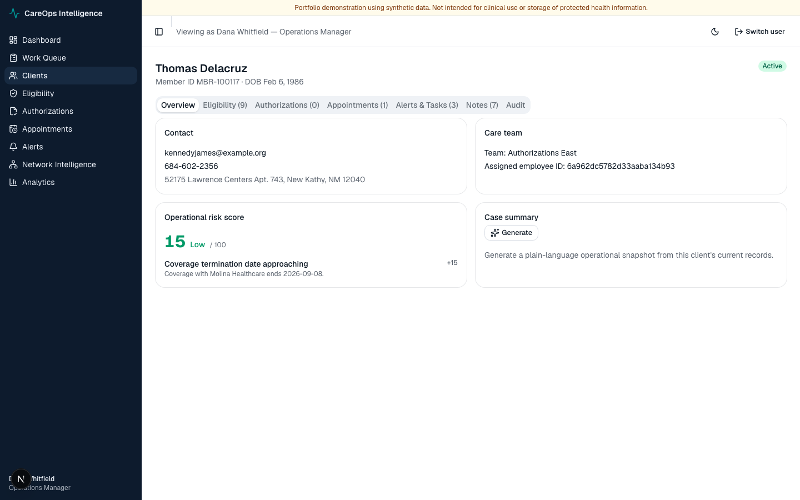
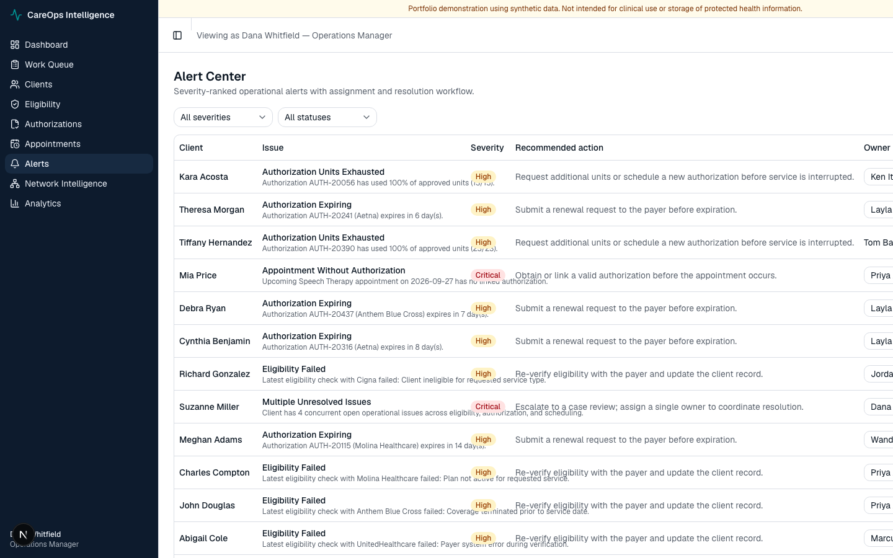
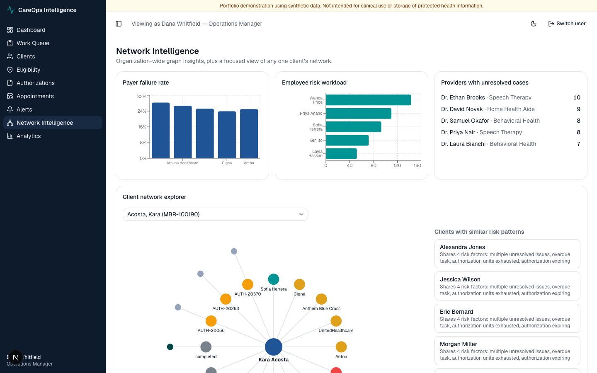
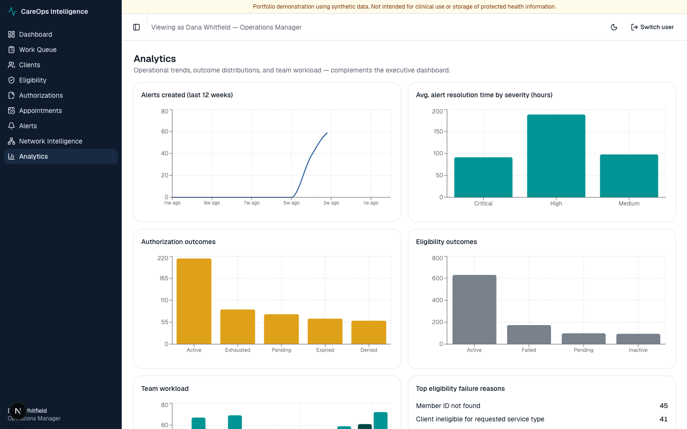

# CareOps Intelligence

A portfolio-quality healthcare **operations management and analytics platform** for a fictional healthcare organization — built to demonstrate full-stack development, data modeling, graph analytics, explainable rule-based scoring, and applied AI, aimed at Data Analyst / Data Scientist and full-stack roles.

> **Portfolio demonstration using synthetic data. Not intended for clinical use or storage of protected health information.** Every dataset is Faker-generated with a fixed random seed. No real patient, provider, or payer data is used anywhere in this project.

## Status

✅ All 9 planned phases complete. See [`docs/architecture.md`](docs/architecture.md) for the original product plan and the phase-by-phase checklist that drove development, or [`docs/recruiter-summary.md`](docs/recruiter-summary.md) for a short non-technical summary and resume bullet points.

## Table of contents

- [Project summary](#project-summary)
- [Business problem](#business-problem)
- [Target users](#target-users)
- [Key features](#key-features)
- [Screenshots](#screenshots)
- [Architecture](#architecture)
- [Technology stack](#technology-stack)
- [MongoDB data model](#mongodb-data-model)
- [Neo4j graph model](#neo4j-graph-model)
- [Risk scoring](#risk-scoring-explainable-not-ml)
- [Local setup](#local-setup)
- [Environment variables](#environment-variables)
- [Seeding synthetic data](#seeding-synthetic-data)
- [Testing](#testing)
- [API documentation](#api-documentation)
- [Deployment](#deployment)
- [Security and privacy](#security-and-privacy)
- [Limitations](#limitations)
- [Future enhancements](#future-enhancements)

## Project summary

CareOps Intelligence is a full operational system of record for a healthcare services organization: client intake, insurance eligibility, prior authorizations, appointment scheduling, and follow-up tasks, unified behind one dashboard instead of scattered across spreadsheets and email. On top of that record it adds the parts a spreadsheet can't do — an **explainable, rule-based risk score** for every client, **automatic alert generation** when operational conditions go bad, a **graph model** (Neo4j) for relationship-shaped questions plain tables answer poorly, and an **AI case-summary generator** that always works offline and only calls a real LLM if you explicitly opt in.

It's built as a realistic layered application (Next.js + FastAPI + MongoDB + Neo4j, Dockerized, tested, CI'd) rather than a script or notebook, because that's the shape of system a healthcare operations team would actually run.

## Business problem

Healthcare operations teams — intake, prior authorization, care coordination — routinely track clients, insurance eligibility, authorizations, appointments, and follow-ups across a mix of spreadsheets, inboxes, and disconnected point tools. Two things are consistently missing:

1. **"What needs attention today?"** — nothing surfaces the handful of cases about to go wrong (an authorization expiring before an appointment, coverage lapsing, a task slipping) out of hundreds of active clients.
2. **"Why is this case risky?"** — even when a problem is flagged, it's rarely explained in a way a non-technical case worker can act on immediately.

CareOps Intelligence addresses both: a prioritized work queue driven by a transparent, factor-by-factor risk score, and alerts that state exactly what's wrong and what to do about it.

## Target users

Three demo roles, switched via a role picker (no real login — see [Security and privacy](#security-and-privacy)):

- **Operations Manager** — executive dashboard, analytics, full access, triggers the alert-generation sweep.
- **Intake Specialist** — client directory, client 360, eligibility center.
- **Authorization Specialist** — authorization tracker, appointment monitor, work queue.

## Key features

- **Executive dashboard** — KPIs (active clients, open high-priority alerts, expiring authorizations, failed eligibility checks) plus trend, payer-performance, and workload charts.
- **Operations work queue** — every open alert and task in one prioritized, filterable table.
- **Client directory & Client 360** — searchable client list; a full per-client profile with tabs for eligibility, authorizations, appointments, alerts & tasks, case notes, and a complete audit trail.
- **Eligibility center, authorization tracker, appointment monitor, alert center** — dedicated operational views for each entity with status-specific filtering (expiring authorizations, failed eligibility checks, alerts by severity, etc.).
- **Network intelligence** — a hand-rolled radial graph visualization of a client's Neo4j "ego network" (assigned employee, payer, risk factors, recent appointments/authorizations), plus a "clients with similar risk patterns" panel powered by shared-risk-factor graph traversal.
- **Analytics** — trend lines, payer performance, workload distribution, alert resolution time, with CSV export.
- **Explainable risk scoring** — a 0–100 score with Low/Medium/High/Critical bands, where every point is traceable to a named, documented factor (see [below](#risk-scoring-explainable-not-ml)).
- **Automatic alert generation** — a one-click sweep (Operations Manager only) that scans all clients against 7 defined conditions and creates any missing alerts, with duplicate prevention so it's safe to re-run.
- **AI case-summary generator** — a plain-language operational snapshot of a client's record. Works with zero API keys via a deterministic template; a real LLM rewrite is available strictly as an opt-in behind an environment variable (see [Risk scoring](#risk-scoring-explainable-not-ml) section and `case_summary.py`).
- **Demo role switcher** — no passwords; a `X-Demo-Role` header stands in for real auth behind a single, swappable server-side dependency.
- **Light/dark mode**, loading skeletons, empty/error states, toasts, and confirmation dialogs throughout.

## Screenshots

| | |
|---|---|
| **Demo entry / role switcher** | **Executive dashboard** |
|  |  |
| **Operations work queue** | **Client directory** |
|  |  |
| **Client 360** | **Alert center** |
|  |  |
| **Network intelligence — ego graph** | **Analytics** |
|  |  |

## Architecture

```
Browser
  │
  ▼
Next.js 16 (App Router, TypeScript, Tailwind, shadcn/ui)   — frontend/
  │  REST/JSON over fetch, X-Demo-Role / X-Demo-User headers
  ▼
FastAPI (Python)                                            — backend/
  ├── routers/       thin HTTP layer — parsing, status codes, no business logic
  ├── services/       risk scoring, alert generation, analytics, CSV export,
  │                    case-summary (template + optional LLM), audit logging
  ├── repositories/   Mongo access (Motor, async) via a generic RepositoryBase,
  │                    + graph sync calls into Neo4j
  ├── graph/          named, documented Cypher queries (cypher.py)
  └── core/           config (pydantic-settings), structured logging, roles
        │                              │
        ▼                              ▼
   MongoDB                         Neo4j
   (source of truth,                (thin relationship nodes —
    full documents)                  id + display fields only)
```

- **Demo auth seam**: there is no real login. The frontend's role switcher stores a role in `localStorage`/React Context and sends it as an `X-Demo-Role` header on every request; the backend validates it against a per-route allowlist via a single FastAPI dependency (`require_role` in `app/core/roles.py`). Swapping in real auth later means replacing that one dependency, not touching every route.
- **MongoDB is the source of truth** for every entity. **Neo4j holds thin nodes** (id + a few display fields, never full documents), kept in sync by idempotent `MERGE`-based Cypher run from the service layer after relevant writes, and in bulk by the seed script. This means the risk score, the alert queue, and the graph can never drift into disagreeing with each other, and there's no dual-write consistency problem to solve.
- **Risk scoring and alert generation are deterministic Python**, not machine learning — see [below](#risk-scoring-explainable-not-ml).

## Technology stack

**Frontend:** Next.js 16 (App Router) · TypeScript (strict) · Tailwind CSS v4 · shadcn/ui (on Base UI) · TanStack Table v8 · Recharts · React Hook Form + Zod · Lucide icons · Vitest + React Testing Library · Playwright

**Backend:** Python · FastAPI · Pydantic v2 · Motor (async MongoDB driver) · the official Neo4j Python driver · Pandas (analytics/CSV export) · Pytest

**Infrastructure:** MongoDB 7 · Neo4j 5 Community · Docker Compose · GitHub Actions CI (Mongo + Neo4j service containers)

## MongoDB data model

All documents carry UTC `created_at`/`updated_at`. IDs are exposed to the frontend as strings (Pydantic schemas convert from Mongo `ObjectId`).

| Collection | Purpose | Key indexes |
|---|---|---|
| `clients` | Client demographic/status/assignment record | unique `member_id`; `status`; `assigned_employee_id`; `assigned_team_id`; text index on name |
| `eligibility_checks` | Insurance eligibility check history per client | `client_id`; `coverage_status`; `check_date` desc |
| `authorizations` | Prior authorizations (units approved/used, expiration) | `client_id`; compound `(status, expiration_date)` |
| `appointments` | Scheduled/completed appointments, linked to an authorization | `client_id`; `appointment_datetime`; `status`; `provider` |
| `alerts` | System- and user-generated operational alerts | compound `(status, severity)`; `assigned_employee_id`; compound `(client_id, alert_type)` for duplicate prevention |
| `tasks` | Follow-up work items | `status`; `due_date`; `assigned_employee_id` |
| `case_notes` | Free-text case notes, client-360 timeline | `client_id`; `created_at` desc |
| `audit_logs` | Full audit trail of create/update actions across all entities | compound `(entity_type, entity_id)`; `timestamp` desc |
| `users` | Demo users (no passwords) for the role switcher | `role` |

Each collection has a MongoDB JSON Schema validator (required fields + enums) applied during setup/seeding, so invalid writes are rejected at the database layer, not only by Pydantic.

## Neo4j graph model

**Nodes** (thin — id + minimal display fields): `Client`, `Employee`, `Team`, `Payer`, `Provider`, `Service`, `Appointment`, `Authorization`, `RiskFactor`

```
(Client)-[:CLIENT_HAS_APPOINTMENT]->(Appointment)
(Appointment)-[:APPOINTMENT_WITH_PROVIDER]->(Provider)
(Appointment)-[:APPOINTMENT_REQUIRES_AUTHORIZATION]->(Authorization)
(Client)-[:CLIENT_COVERED_BY_PAYER]->(Payer)
(Client)-[:CLIENT_HAS_AUTHORIZATION]->(Authorization)
(Authorization)-[:AUTHORIZATION_FOR_SERVICE]->(Service)
(Client)-[:CLIENT_ASSIGNED_TO_EMPLOYEE]->(Employee)
(Employee)-[:EMPLOYEE_MEMBER_OF_TEAM]->(Team)
(Client)-[:CLIENT_HAS_RISK_FACTOR]->(RiskFactor)
```

All Cypher lives in [`backend/app/graph/cypher.py`](backend/app/graph/cypher.py), documented per query. It answers five business questions the graph shape is suited for, surfaced through `/api/v1/graph/insights/*` and the Network Intelligence page:

1. **Upcoming appointments without a valid authorization** — pure graph traversal with a negative existence check.
2. **Providers connected to the most unresolved authorization cases** — traversal + aggregation, ranked descending.
3. **Payer with the highest eligibility-failure rate** — a deliberate *hybrid* query: "failed" is a Mongo fact (`eligibility_checks.coverage_status`), while "total clients covered" comes from the graph's `CLIENT_COVERED_BY_PAYER` edges. Documented in `cypher.py` as hybrid rather than pretending either store alone answers it.
4. **Employees with the highest-risk client workload** — traversal from `Employee` through assigned `Client`s to their `RiskFactor` nodes, counted and ranked.
5. **Clients with similar risk patterns** — clients that share `RiskFactor` nodes, powering the "similar cases" panel on the Network Intelligence page.

## Risk scoring (explainable, not ML)

Deliberately rule-based rather than machine learning, so every point on a client's score is traceable to a named, documented factor an operations user can see and act on. The scoring logic lives in exactly one place — [`backend/app/services/risk_scoring.py`](backend/app/services/risk_scoring.py) — and the automatic alert-generation sweep ([`backend/app/services/alert_generation.py`](backend/app/services/alert_generation.py)) checks the same underlying conditions, so the numeric score and the alert queue can never disagree.

| Factor | Points |
|---|---|
| Upcoming appointment without a valid authorization | 25 |
| Latest eligibility check failed | 20 |
| Authorization expiring within 14 days | 15 |
| Authorization units nearly exhausted (≥90% used) | 15 |
| Coverage termination date within 30 days | 15 |
| Multiple (2+) unresolved alerts | 15 |
| Overdue operational task | 15 |

Score is the sum of triggered factors, capped at 100, and mapped to a band: **Critical** (≥75) · **High** (≥50) · **Medium** (≥25) · **Low** (<25).

The **AI case-summary generator** (`backend/app/services/case_summary.py`) follows the same "always works, opt-in upgrade" philosophy: a `SummaryProvider` interface has a `TemplateSummaryProvider` (default, deterministic, zero dependencies) and an `LLMSummaryProvider` that only activates if `ENABLE_LLM_SUMMARY=true` and an API key is supplied. Generated summaries are always visibly labeled and never contain clinical recommendations — only an operational snapshot of the record.

## Local setup

Requires Docker Desktop.

```bash
git clone https://github.com/kavyasmehta/careops-intelligence.git
cd careops-intelligence
cp .env.example .env
docker compose up --build
```

- Frontend: http://localhost:3000
- Backend health check: http://localhost:8000/health
- API docs (Swagger UI): http://localhost:8000/docs
- Neo4j Browser: http://localhost:7475 (user `neo4j`, password from `.env`)

Runs on non-default host ports (Mongo `27018`, Neo4j `7688`/`7475`) so it doesn't collide with any other locally running Mongo/Neo4j instance.

For faster backend-only iteration without Docker:

```bash
cd backend
python3 -m venv .venv && source .venv/bin/activate
pip install -r requirements.txt
uvicorn app.main:app --reload
```

For frontend-only iteration without Docker:

```bash
cd frontend
npm install
npm run dev
```

## Environment variables

See [`.env.example`](.env.example) — copy it to `.env` before running. Never commit a real `.env` file.

| Variable | Purpose |
|---|---|
| `MONGO_URI`, `MONGO_DB` | MongoDB connection |
| `NEO4J_URI`, `NEO4J_USER`, `NEO4J_PASSWORD` | Neo4j connection |
| `CORS_ORIGINS` | Allowed frontend origins |
| `SEED_RANDOM_SEED` | Fixed seed for reproducible synthetic data (default `42`) |
| `ENABLE_LLM_SUMMARY` | Off by default. Set `true` to opt into real LLM case summaries (also requires `LLM_API_KEY` and `pip install anthropic`) |
| `LLM_API_KEY` | API key for the optional LLM summary provider |
| `NEXT_PUBLIC_API_BASE_URL` | Base URL the frontend uses to reach the backend |

## Seeding synthetic data

Once the containers are up:

```bash
./scripts/run_seed.sh
```

Generates, with a fixed random seed (safe to re-run — it clears and rebuilds):

- ~250 clients, 5 payers, 15 providers, 10 employees, 6 teams
- 1,000 eligibility checks, 500 authorizations, 1,000 appointments
- ~300 alerts, 500 tasks, 1,000 case notes

...into MongoDB, then builds the corresponding Neo4j graph from that same data — including intentionally problematic scenarios (expired authorizations, failed eligibility checks, unlinked appointments) so every page and alert type has real examples to show.

## Testing

- **Backend (Pytest, 48 tests)** — CRUD + validation for every entity, risk-scoring factor combinations, alert-generation dedup logic, dashboard/analytics calculations, graph query correctness, and API error handling:
  ```bash
  cd backend && source .venv/bin/activate && pytest
  ```
- **Frontend unit tests (Vitest + React Testing Library, 14 tests)** — critical forms, work-queue alert actions, client-profile rendering, loading/error/empty states, and the paginated-list hook:
  ```bash
  cd frontend && npm run test
  ```
- **End-to-end (Playwright)** — one full workflow against the real running stack: enter as an Operations Manager → open the work queue → filter to a critical case → review that client's profile → go to the alert center and resolve the alert → confirm the dashboard's open-alert KPI actually decreases. Requires the full `docker compose` stack to be up and seeded:
  ```bash
  cd frontend && npm run test:e2e
  ```
  Because this test resolves a real alert, re-run `./scripts/run_seed.sh` afterward to restore pristine demo data if you plan to demo the app next.
- **CI**: every push/PR runs the backend suite against real Mongo + Neo4j service containers, and the frontend suite (lint, Vitest, build) — see [`.github/workflows/ci.yml`](.github/workflows/ci.yml).

## API documentation

Interactive OpenAPI/Swagger docs are auto-generated by FastAPI at **http://localhost:8000/docs** whenever the backend is running. See also [`docs/api-examples.md`](docs/api-examples.md) for copy-pasteable `curl` examples covering the demo-role header, common list/filter queries, risk scoring, alert generation, and the case-summary endpoint.

## Deployment

Built to be deployment-ready without requiring live hosting for this portfolio:

- `backend/Dockerfile` and `frontend/Dockerfile` are production-oriented multi-stage builds usable as-is on any container platform (e.g. Render, Railway, Fly.io for the backend; Vercel or any Node host for the frontend).
- The frontend's only runtime dependency is `NEXT_PUBLIC_API_BASE_URL`, making it deployable to Vercel pointed at a separately-hosted backend.
- The backend needs a reachable MongoDB (e.g. Atlas) and Neo4j (e.g. AuroraDB) instance in production — swap `MONGO_URI`/`NEO4J_URI` in the environment, no code changes required.
- `docker-compose.yml` is the reference for exactly what services and environment variables a production deployment needs.

This project intentionally stays local-only (no live URLs) — see the architecture doc's scope notes.

## Security and privacy

- **All data is synthetic.** No real client, patient, or provider information exists anywhere in this repository or its generated data.
- **No real authentication.** The role switcher is a portfolio simplification, not a security boundary — every request just carries a self-declared `X-Demo-Role` header. This is explicitly documented so it's never mistaken for production-ready auth; the intended swap point (`app/core/roles.py`) is a single, isolated dependency.
- **No HIPAA compliance claims of any kind.** The synthetic-data disclaimer is shown persistently in the app UI (entry screen and top banner) and in every AI-generated case summary.
- **The optional LLM case-summary feature never sends data anywhere unless `ENABLE_LLM_SUMMARY=true` is explicitly set** with a valid API key; the default path is a fully local, deterministic template.

## Limitations

- No real authentication/authorization — demo role switcher only.
- No production secrets management, rate limiting, or multi-tenancy.
- Alert generation runs on-demand via a button, standing in for what would be a scheduled background job in production.
- Graph sync (Mongo → Neo4j) happens per-write from the service layer; there's no separate change-data-capture pipeline, so a direct database write bypassing the API would not propagate to the graph.
- Analytics are computed on read rather than pre-aggregated, which is fine at this synthetic dataset's scale but would need materialized aggregates at real production volume.

## Future enhancements

- Real authentication (JWT/OAuth) behind the existing `require_role` seam.
- A scheduled job runner (e.g. APScheduler or a worker queue) for alert generation instead of the manual sweep button.
- Materialized/pre-aggregated analytics for scale.
- Notification delivery (email/SMS) when critical alerts are generated.
- Expanded graph intelligence: provider-network gap analysis, referral pattern detection.

## License / disclaimer

All data in this project is synthetic and generated for demonstration purposes only. This is a personal portfolio project and is not affiliated with any healthcare organization.
